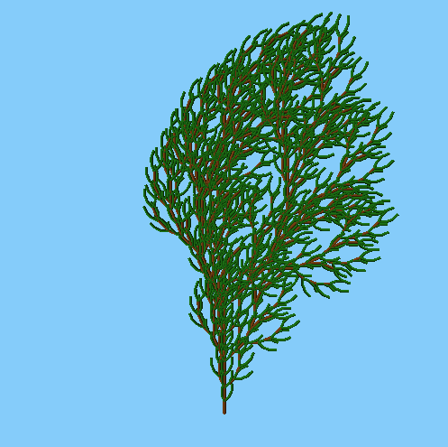

# l-system-trees
OpenGL program which draws trees using L-systems and turtle graphics

## Build Instructions
The project can be built using Visual Studio by opening finalProject.vcxproj and building
the project.

## Running Instructions
To run the program, it requires one command line argument which is the filename of
the l-system input. The input file must have the following format:
```
[iteration depth]
[turning angle in degrees]
[Axiom]
[Rule 1]
...
[Rule X]
```
Any number of rules may be included. The rule must be written as a single character followed
by ‘=’ followed by the rule body. E.g. `X=F[+X]F[-X]`.

The symbols used may or may not be special symbols which define the instructions for the
turtle graphics system. These are described in the following section.
Various sample input files are included in the folder ‘samples’.

## Turtle Instruction Set
The following are the characters which provide instructions for the turtle graphics generator:
* `F` moves the turtle forward, drawing a cylinder on its path
* `+` turns the turtle to the right, that is, in the positive x direction
* `-` turns the turtle to the left, that is, in the negative x direction
* `^` turns the turtle’s pitch up, that is in the negative y direction
* `&` turns the turtle’s pitch down, that is in the positive y direction
* `[` pushes the turtles state onto a stack, that is begins a new branch
* `]` returns the turtle to the root of a branch
* `T` indicates that branch texture should be used
* `L` indicates that leaf texture should be used

## Camera Controls
The camera view can be rotated using the keys `WASD`. The `E` key zooms in. The `Q` key
zooms out.

## Sample Outputs



